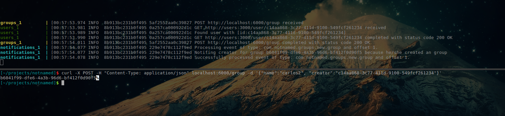

Taking it for a spin:

```bash
docker-compose up groups notifications
``` 

```bash
curl -i -X POST -H "Content-Type: application/json" localhost:3000/user -d '{"email":"email@carlos.com"}'
```

```bash
curl -X POST -H "Content-Type: application/json" localhost:6000/group -d '{"name":"carlos2", "creator":"db804f90-4259-4eed-8949-1509a4288035"}'

```

(don't forget to change the user id for the creator in the second request to the one you've just created)


Calling the groups endpoint should yield something like this:

 